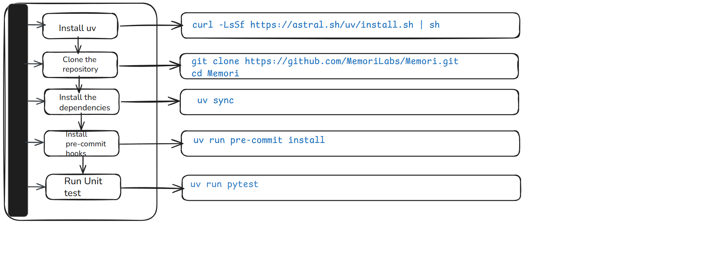

[](https://memorilabs.ai/)

# Contributing to Memori SDKs

Thank you for your interest in contributing to Memori!

This repository contains:

- `memori/` - Python SDK
- `memori-ts/` - TypeScript SDK (including BYODB via Rust native bindings)

## Development Setup

We use `uv` for fast dependency management and Docker for integration testing. You can develop locally or use our Docker environment.

### Prerequisites

- Python 3.10+ (3.12 recommended)
- [uv](https://github.com/astral-sh/uv) - Fast Python package installer
- Docker and Docker Compose (for integration tests)
- Make
- Node.js 20+
- npm

### Rust Toolchain (when needed)

Both SDKs share the Rust core (`core/`).

Install Rust (`rustup`, `cargo`) when you are:

- changing code in `core/`
- working on `core/bindings/python`
- working on `core/bindings/node` or TypeScript BYODB native flows

If you are only changing pure Python SDK code (outside Rust/bindings), Rust is not required.

## Quick Start Flow



### Quick Start (Local Development)

**Linux/Mac:**

```bash
# Install uv if you haven't already
curl -LsSf https://astral.sh/uv/install.sh | sh
```

**Windows (PowerShell):**

```powershell
powershell -c "irm https://astral.sh/uv/install.ps1 | iex"
```

```bash
# Clone the repository
git clone https://github.com/MemoriLabs/Memori.git
cd Memori

# Install dependencies
uv sync

# Install pre-commit hooks
uv run pre-commit install

# Run unit tests
uv run pytest
```

### Quick Start (Full-stack: Python + TypeScript + Rust)

```bash
# Clone the repository
git clone https://github.com/MemoriLabs/Memori.git
cd Memori

# Python deps
uv sync
uv run pre-commit install

# TypeScript deps
cd memori-ts && npm ci && cd ..

# Node native-binding deps (needed for sync-native)
cd core/bindings/node && npm ci && cd ../..
```

### Quick Start (Docker)

```bash
# Copy the example environment file
cp .env.example .env

# Edit .env and add your API keys (optional for unit tests)
# Required for integration tests: OPENAI_API_KEY, ANTHROPIC_API_KEY, GOOGLE_API_KEY

# Start the environment
make dev-up
```

This will:

- Build the Docker container with Python 3.12
- Install all dependencies with uv
- Start PostgreSQL, MySQL, and MongoDB for integration tests
- Start Mongo Express (web UI for MongoDB at http://localhost:8081)

### Development Commands

#### Local Development

```bash
# Run unit tests
uv run pytest

# Format code
uv run ruff format .

# Check linting
uv run ruff check .

# Run with coverage
uv run pytest --cov=memori

# Run security scans
uv run bandit -r memori -ll -ii
uv run pip-audit --require-hashes --disable-pip || true
```

#### Docker Development

```bash
# Enter the development container
make dev-shell

# Run unit tests (fast, no external dependencies)
make test

# Initialize database schemas
make init-postgres  # PostgreSQL
make init-mysql     # MySQL
make init-oceanbase # OceanBase
make init-mongodb   # MongoDB
make init-sqlite    # SQLite

# Run a specific integration test script
make run-integration FILE=tests/llm/clients/oss/openai/async.py

# Format code
make format

# Check linting
make lint

# Run security scans
make security

# Stop the environment
make dev-down

# Clean up everything (containers, volumes, cache)
make clean
```

#### TypeScript Development (`memori-ts/`)

```bash
cd memori-ts

# Install Node dependencies
npm ci

# Unit tests (native module is mocked; Rust not required)
npm test

# Lint + type/build checks
npm run lint
npm run build
```

##### Native BYODB Development

```bash
cd memori-ts

# Build Rust N-API bindings and sync artifacts into memori-ts/src/native and dist/native
npm run sync-native

# Native + TypeScript build (used by examples)
npm run build:dev
```

Notes:

- `sync-native` is the explicit native step for TypeScript BYODB.
- Rust is required for `sync-native` / `build:dev`, but not for regular unit tests.
- For short-lived BYODB scripts, call `await mem.augmentation.wait()` before exit to ensure all background writes complete.

## Testing

We use `pytest` with coverage reporting and `pytest-mock` for mocking.

### Unit Tests

Unit tests use mocks and run without external dependencies:

```bash
# Local
uv run pytest

# Docker
make test
```

### Integration Tests

Integration tests require:

- Database instances (PostgreSQL, MySQL, MongoDB, or SQLite)
- LLM API keys (OpenAI, Anthropic, Google)

```bash
# Set API keys in .env first
# OPENAI_API_KEY=sk-...
# ANTHROPIC_API_KEY=sk-ant-...
# GOOGLE_API_KEY=...

# Initialize database schema
make init-postgres  # or init-mysql, init-oceanbase, init-mongodb, init-sqlite

# Run integration test scripts
make run-integration FILE=tests/llm/clients/oss/openai/sync.py
```

### Test Coverage

We maintain high test coverage. Coverage reports are generated automatically:

- Terminal output (summary)
- HTML report in `htmlcov/`
- XML report in `coverage.xml`

View HTML coverage:

```bash
open htmlcov/index.html  # macOS
xdg-open htmlcov/index.html  # Linux
```

## Troubleshooting

### 1. uv Installation Fails

**Linux/Mac:**

```bash
# If curl command fails, try pip instead
pip install uv

# Verify installation
uv --version
```

**Windows (PowerShell):**

```powershell
powershell -c "irm https://astral.sh/uv/install.ps1 | iex"

# Verify
uv --version
```

### 2. `uv sync` Fails

**Error:** `No solution found`

```bash
# Clear cache and retry
uv cache clean
uv sync

# Check Python version (must be 3.10+)
python --version
```

**Error:** `Permission denied`

```bash
# Fix directory ownership (Linux/Mac)
sudo chown -R $USER ~/.cache/uv
sudo chown -R $USER .venv

# OR reinstall uv in user-writable location
curl -LsSf https://astral.sh/uv/install.sh | sh

# Windows — fix cache permissions
icacls .venv /grant %USERNAME%:F
```

### 3. Docker Won't Start

**Error:** `Cannot connect to Docker daemon`

```bash
# Linux
sudo systemctl start docker

# Mac/Windows — open Docker Desktop app first

# Verify Docker is running
docker ps
```

**Error:** `Port already in use`

```bash
# Windows
netstat -ano | findstr :8081

# Linux/Mac
lsof -i :8081

# Then stop that process or change port in docker-compose.yml
```

### 4. Pre-commit Hooks Failing

**Error:** `Ruff formatting issues`

```bash
# Auto-fix formatting
uv run ruff format .

# Auto-fix linting
uv run ruff check --fix .

# Retry commit
git commit -m "your message"
```

**Error:** `pre-commit command not found`

```bash
# Reinstall hooks
uv run pre-commit install

# Run manually
uv run pre-commit run --all-files
```

### 5. Rust Build Errors

**Error:** `cargo not found`

```bash
# Install Rust
curl --proto '=https' --tlsv1.2 -sSf https://sh.rustup.rs | sh

# Reload terminal then verify
rustc --version
cargo --version
```

**Error:** `Rust version too old`

```bash
# Update Rust
rustup update stable
```

### 6. pytest Failures

**Error:** `Module not found`

```bash
# Reinstall dependencies
uv sync

# Always run pytest via uv
uv run pytest
```

**Error:** `API key missing`
(integration tests only — not needed for unit tests)

```bash
# Only needed when running integration tests:
cp .env.example .env

# Add keys:
OPENAI_API_KEY=sk-...
ANTHROPIC_API_KEY=sk-ant-...
GOOGLE_API_KEY=...

# Then run integration tests:
make run-integration FILE=tests/llm/clients/oss/openai/sync.py
```

### 7. TypeScript / npm Errors

**Error:** `npm ci fails`

```bash
# Check Node version (must be 20+)
node --version

# Clear cache and retry
npm cache clean --force
cd memori-ts && npm ci
```

**Error:** `Native module not found`

```bash
# Build Rust bindings first
cd memori-ts
npm run sync-native
```

### Still Stuck?

1. Search [existing issues](https://github.com/MemoriLabs/Memori/issues) for your error
2. Open a new issue with:
   - Your OS and Python version (`python --version`)
   - Full error message
   - Steps you already tried

## Project Structure

```
📦 Memori/
├── 📂 memori/              # Python SDK source
│   ├── 📂 llm/             # LLM provider integrations
│   ├── 📂 memory/          # Memory system
│   ├── 📂 storage/         # Storage adapters
│   ├── 📂 api/             # API client
│   ├── 🐍 __init__.py      # Main class & public API
│   └── 🏷️  py.typed         # PEP 561 marker
├── 📂 tests/
│   ├── 📂 build/           # DB initialization scripts
│   ├── 📂 llm/             # LLM tests
│   ├── 📂 memory/          # Memory tests
│   └── 📂 storage/         # Storage tests
├── 🐍 conftest.py          # Pytest fixtures
├── ⚙️  pyproject.toml       # Project metadata
├── 🔒 uv.lock              # Locked dependencies
└── 📝 CHANGELOG.md         # Version history
```

## Code Quality

We use [Ruff](https://docs.astral.sh/ruff/) for linting and formatting (configured in `pyproject.toml`):

```bash
# Format code
uv run ruff format .     # or: make format

# Check linting
uv run ruff check .      # or: make lint

# Auto-fix issues
uv run ruff check --fix .

# Run security scans (Bandit + pip-audit)
uv run bandit -r memori -ll -ii
uv run pip-audit --require-hashes --disable-pip || true
```

### Pre-commit Hooks

We use pre-commit to automatically format and lint code:

```bash
# Install hooks (one-time setup)
uv run pre-commit install

# Run manually
uv run pre-commit run --all-files
```

### Code Standards

- Follow PEP 8 standards
- Line length: 88 characters (Black-compatible)
- Python 3.10+ syntax (use modern type hints)
- All public APIs must have type hints
- Lean, simple code preferred over complex solutions (KISS, YAGNI)
- Minimize unnecessary comments - code should be self-documenting

## Pull Request Guidelines

1. **Fork and branch**: Create a feature branch from `main`
2. **Write tests**: Add/update tests for your changes
3. **Pass all checks**: Ensure tests, linting, and formatting pass
4. **Update docs**: Update README or docs if adding features
5. **Changelog**: Add entry to CHANGELOG.md under "Unreleased"
6. **Atomic commits**: Keep commits focused and well-described

If your PR touches `memori-ts/`, run and verify:

```bash
cd memori-ts
npm test
npm run lint
npm run build
```

## Supported Integrations

### LLM Providers

- OpenAI (sync/async, streaming)
- Anthropic Claude (sync/async, streaming)
- Google Gemini (sync/async, streaming)
- AWS Bedrock

### Frameworks

- Agno
- LangChain

### Database Adapters

- PostgreSQL (via psycopg2, psycopg3)
- MySQL / MariaDB (via pymysql)
- MongoDB (via pymongo)
- Oracle (via cx_Oracle, python-oracledb)
- SQLite (stdlib)
- CockroachDB
- Neon, Supabase (PostgreSQL-compatible)
- Django ORM
- DB-API 2.0 compatible connections

## CLI Commands

Memori provides CLI commands for managing your account:

The CLI uses exported environment variables first, then fills missing values from a `.env` file in the directory where you run the command.

```bash
# Sign up for Memori Advanced Augmentation
python3 -m memori sign-up <email_address>
```

These commands help you:


- Sign up for increased limits (always free for developers)
- Obtain API keys for Advanced Augmentation features

## Development Notes

- Docker files (Dockerfile, docker-compose.yml, Makefile) are for development only
- They are NOT included in the PyPI package
- The SDK has minimal runtime dependencies - fully self-contained
- Development dependencies (LLM clients, database drivers) are in `[dependency-groups]`
